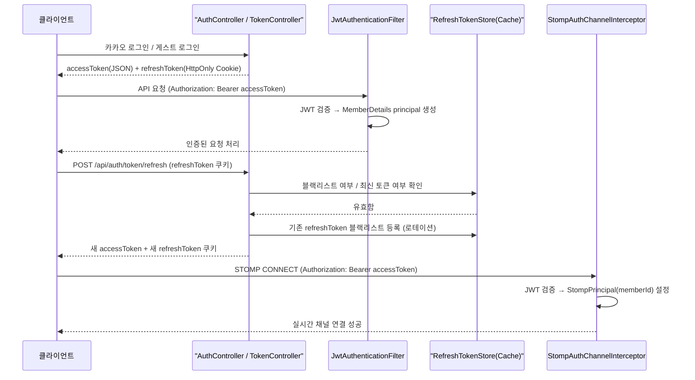
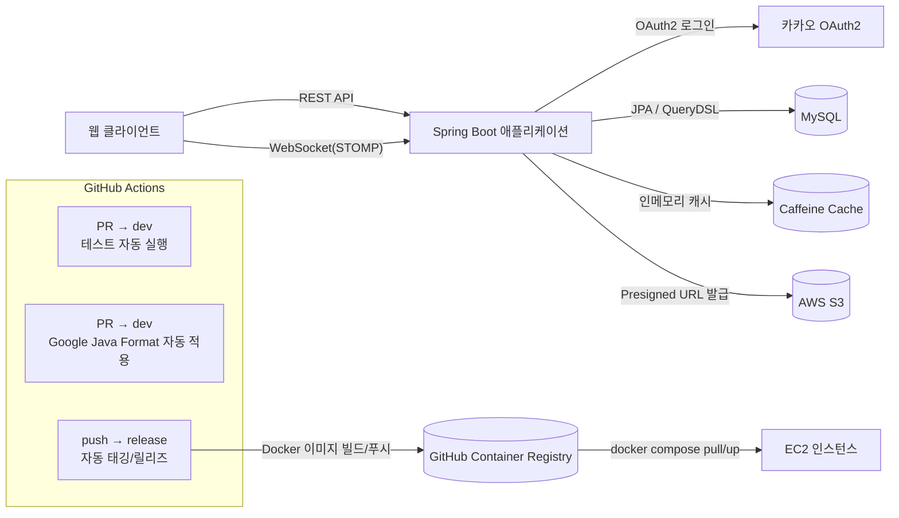

# WEB5_7_OronaminC_BE

[프로그래머스 백엔드 데브코스 최종프로젝트] 5기 7회차 8팀 BE 저장소입니다.

## 1. 프로젝트 소개

**OronaminC**는 발표(프레젠테이션) 도중 발표자와 청중이 실시간으로 질문·답변·공감(리액션)을
주고받을 수 있는 **발표방(Q&A) 플랫폼**의 백엔드 서버입니다.

- 발표자는 발표방을 만들고 발표자료(문서)를 업로드한 뒤, 비밀코드로 팀원/청중을 초대합니다.
- 청중은 발표를 들으며 실시간으로 질문을 남기고, 발표자·팀원은 실시간으로 답변합니다.
- 질문/답변/발표방에는 이모지로 공감을 표시할 수 있고, 발표가 끝나면 결과 리포트를 조회할 수 있습니다.

REST API로 리소스를 관리하고, WebSocket(STOMP)으로 질문·답변·공감의 실시간 동기화를 처리하는
구조로 설계했습니다.

## 2. 주요 기능

### 인증 / 회원
- 카카오 소셜 로그인(OAuth2), 비회원(게스트) 로그인
- JWT 기반 Access/Refresh Token 발급 및 재발급(로테이션), 로그아웃
- 회원 프로필 조회/수정, 회원 존재 여부 확인
- 내가 생성했거나 참여한 발표방 목록 조회

### 발표방(Room)
- 발표방 생성 · 수정 · 삭제
- 비밀코드를 이용한 발표방 입장
- 발표방 상태 관리(시작 전 / 진행 중 / 종료), PUBLIC/PRIVATE 공개 범위
- 발표 종료 후 결과 리포트 조회

### 실시간 질문·답변·공감 (WebSocket / STOMP)
- 질문 실시간 생성 · 수정 · 삭제, 질문 목록 REST 조회
- 답변 실시간 생성 · 수정 · 삭제, 답변 목록 REST 조회
- 질문 / 답변 / 발표방에 대한 실시간 이모지 공감 생성 · 삭제
- 참가자 유형(발표자 / 팀원 / 게스트)에 따른 권한 분리
- Bucket4j 기반 요청 속도 제한(질문 생성, 답변 생성, 이모지 공감)

### 발표자료(Document)
- 클라이언트가 AWS S3에 파일을 직접 업로드할 수 있도록 Presigned URL 발급

## 3. 권한/인증 구조

Spring Security + JWT를 기반으로 REST API와 WebSocket(STOMP) 인증을 각각 별도 파이프라인으로 구성했습니다.

**로그인 & 토큰 발급**
- 카카오 OAuth2 로그인 또는 게스트 로그인 성공 시 `JwtTokenProvider`가 Access/Refresh Token 쌍을 발급합니다.
- Access Token은 응답 바디로 전달되어 이후 요청의 `Authorization: Bearer <token>` 헤더로 사용되고,
  Refresh Token은 `HttpOnly` + `Secure` + `SameSite=None` 쿠키로 내려갑니다.

**REST API 인증 (`JwtAuthenticationFilter`)**
- 매 요청마다 `Authorization` 헤더의 JWT를 검증하고, `MemberDetails`(id/nickname/role)를 만들어
  `SecurityContext`의 principal로 설정합니다. `@AuthenticationPrincipal MemberDetails`로 컨트롤러에서 바로 사용합니다.

**Refresh Token 재발급 & 무효화 (`RefreshTokenStore`, 캐시 기반)**
- 회원별 "가장 최근에 발급된" refresh token과, 이미 사용/무효화된 토큰의 블랙리스트를 캐시(Caffeine)에 보관합니다.
- `/api/auth/token/refresh` 호출 시 토큰이 없거나, 블랙리스트에 있거나, 최신 토큰이 아니면 재발급을 거부합니다(400).
- 재발급 성공 시 기존 refresh token은 즉시 블랙리스트로 등록되어(로테이션) 재사용을 차단합니다.
- 로그아웃 시에도 현재 refresh token을 블랙리스트에 등록하고, 응답에 만료 쿠키(`Max-Age=0`)를 실어 보냅니다.

**인증 실패 응답 분리 (`RestAuthenticationEntryPoint`)**
- `oauth2Login()`이 등록하는 기본 동작은 인증되지 않은 요청을 카카오 로그인 페이지로 302 리다이렉트시킵니다.
  브라우저 로그인 흐름에는 맞지만 JWT 기반 REST 클라이언트에는 부적절한 동작입니다.
- `exceptionHandling().defaultAuthenticationEntryPointFor(...)`로 `/api/**` 요청만 골라
  이 프로젝트의 `ErrorCode` 컨벤션에 맞춘 401 JSON(`UNAUTHORIZED_MEMBER`)으로 응답하도록 분리했고,
  실제 브라우저의 카카오 로그인 흐름은 기존 리다이렉트 동작을 그대로 유지합니다.

**WebSocket(STOMP) 인증 (`StompAuthChannelInterceptor`)**
- HTTP 요청의 `SecurityContext`에 의존하지 않고, STOMP `CONNECT` 프레임의 `Authorization` 네이티브 헤더에서
  JWT를 직접 꺼내 검증합니다.
- 인증 성공 시 `StompPrincipal(memberId)`을 세션에 설정하고, 실패 시 `ErrorException(UNAUTHORIZED_MEMBER)`을 던져
  `StompErrorHandler`가 STOMP `ERROR` 프레임으로 변환해 클라이언트에 전달합니다.



## 4. 기술 스택

| 구분 | 내용 |
|---|---|
| 언어 | Java 21 |
| 프레임워크 | Spring Boot 3.5.3 (Web, WebSocket, Security, OAuth2 Client, Data JPA, Validation, Cache) |
| 인증 | JWT(jjwt 0.12.6), Spring Security, OAuth2(카카오 로그인) |
| DB / ORM | MySQL, Spring Data JPA + QueryDSL 5.0.0(Jakarta), H2(테스트) |
| 캐시 | Caffeine (Refresh Token 최신/블랙리스트 관리, 도메인 캐시) |
| 실시간 통신 | WebSocket / STOMP |
| 파일 저장 | AWS S3 (Presigned URL 발급, AWS SDK v2) |
| 요청 제한 | Bucket4j |
| API 문서 | springdoc-openapi(Swagger UI) |
| 기타 라이브러리 | spring-retry, commons-lang3 |
| 테스트 | JUnit5, Mockito, AssertJ, Spring Boot Test, Spring Security Test, JaCoCo |
| 빌드 / 배포 | Gradle, Docker(멀티스테이지 빌드), GitHub Actions, GHCR, EC2 |

## 5. 시스템 아키텍처



각 도메인(`room`, `question`, `answer`, `emoji`, `member` 등)은 `api(Controller) → service → dao(Repository) / Reader → domain(Entity)`
레이어로 구성되며, 여러 도메인에 걸친 유스케이스는 별도의 Facade(예: `EmojiFacade`)로 분리했습니다.
DTO 변환은 도메인별 `mapper`가 담당합니다.

## 6. 트러블슈팅

리팩토링 과정에서 실제로 겪고 해결한 문제들입니다.

### Refresh Token이 실제로는 블랙리스트에 등록되지 않던 버그
- **문제**: 로그아웃하거나 토큰을 재발급받아도 이전 refresh token이 여전히 유효하게 재사용될 수 있는 상태였습니다.
- **원인**: `refreshTokenStore.isBlacklisted(refresh)`를 호출만 하고 반환값을 사용하지 않고 있었습니다. 실제로 등록하는
  코드(`blacklist()`)가 아니라 조회만 하는 코드가 잘못 호출되고 있던, 이름이 비슷해서 생긴 실수였습니다.
- **해결**: 블랙리스트 등록 전용 메서드 `blacklist(refreshToken)`을 추가하고, 로그아웃/토큰 재발급 두 지점 모두
  이 메서드를 호출하도록 수정했습니다.
- **배운 점**: 반환값을 쓰지 않는 메서드 호출은 컴파일 에러가 나지 않아 리뷰 없이는 놓치기 쉽습니다. 부수효과가
  없어 보이는 호출을 보면 의도를 의심해봐야 합니다.

### 로그아웃 응답에 만료 쿠키가 실제로 실리지 않던 문제
- **문제**: 로그아웃 API를 호출해도 브라우저에 refreshToken 쿠키가 그대로 남아 있었습니다.
- **원인**: 만료 쿠키(`maxAge(0)`) 객체는 만들었지만, 그 객체를 실제 응답 헤더에 실어 보내는
  `response.setHeader(...)` 호출이 빠져 있었습니다.
- **해결**: `response.setHeader(HttpHeaders.SET_COOKIE, expired.toString())`를 명시적으로 추가했습니다.
- **배운 점**: 값 객체를 만드는 것과 그것을 실제 응답에 반영하는 것은 별개의 단계이며, 둘 다 있어야 동작이 완성됩니다.

### WebSocket 인증이 구조적으로 동작하기 어려운 상태였던 문제
- **문제**: `StompAuthChannelInterceptor`가 `SecurityContextHolder`에서 인증 정보를 꺼내 STOMP 세션에 붙이는
  방식이었는데, WebSocket CONNECT 처리 시점에는 HTTP 요청 스레드의 `SecurityContext`가 비어 있을 수 있는 구조였습니다.
- **원인**: HTTP 인증(`JwtAuthenticationFilter`)과 WebSocket 인증(`StompAuthChannelInterceptor`)이 서로 다른
  시점/스레드에서 동작하는데, 후자가 전자의 부산물에 암묵적으로 의존하고 있었습니다.
- **해결**: STOMP `CONNECT` 프레임의 `Authorization` 헤더에서 JWT를 직접 꺼내 검증하고, `StompPrincipal(memberId)`을
  직접 만들어 세션에 설정하도록 변경해 `SecurityContext` 의존을 제거했습니다.
- **배운 점**: HTTP와 WebSocket은 별개의 인증 파이프라인으로 다뤄야 합니다. 한 프로토콜의 인증 결과를 다른
  프로토콜 컨텍스트에서 그대로 재사용하려는 시도는 프레임워크의 스레드/컨텍스트 경계를 넘는 순간 깨지기 쉽습니다.

### 인증 실패 응답이 REST API 클라이언트에 맞지 않던 문제
- **문제**: `Authorization` 헤더 없이 보호된 `/api/**`를 호출하면 401이 아니라 302(카카오 로그인 페이지 리다이렉트)가
  응답되고 있었습니다.
- **원인**: `oauth2Login()`이 등록하는 기본 `AuthenticationEntryPoint`가 "브라우저의 로그인 흐름"을 전제로 설계되어,
  인증되지 않은 모든 요청을 로그인 페이지로 리다이렉트시켰습니다.
- **해결**: `/api/**` 전용 `RestAuthenticationEntryPoint`를 추가해 이 프로젝트의 `ErrorException`/`ErrorCode`
  컨벤션에 맞춘 401 JSON을 응답하게 하고, `exceptionHandling().defaultAuthenticationEntryPointFor(entryPoint, matcher)`로
  경로 기반 분기를 적용했습니다. 실제 브라우저의 카카오 로그인 흐름(Accept: text/html)은 기존 리다이렉트를 그대로 유지합니다.
- **배운 점**: 여러 인증 메커니즘(OAuth2 로그인 / JWT API)이 한 서버에 공존할 때는 "인증 실패 시 무엇을 응답할지"를
  요청 종류에 따라 명확히 분리해서 설정해야 합니다.

### 예외 처리 컨벤션 불일치로 인한 잘못된 상태 코드 (500 vs 400)
- **문제**: 이미 사용됐거나 무효화된 refresh token으로 재발급을 시도하면 400이 아니라 500(Internal Server Error)이
  응답되고 있었습니다.
- **원인**: 컨트롤러가 `IllegalArgumentException`을 던졌는데, 전역 예외 처리기(`ExceptionAdvice`)에는 이 예외 전용
  핸들러가 없어 범용 `Exception` 핸들러(500)로 처리되고 있었습니다.
- **해결**: 이 프로젝트가 이미 쓰고 있던 `ErrorException` + `ErrorCode` 컨벤션에 맞춰 `INVALID_REFRESH_TOKEN`(400)
  코드를 추가하고, 해당 예외로 교체했습니다.
- **배운 점**: 새 예외를 던지기 전에 전역 예외 처리기가 그 타입을 실제로 처리할 수 있는지 먼저 확인해야 하며,
  이미 컨벤션이 있다면 새로 만들기보다 거기에 맞추는 편이 일관된 API 응답을 만듭니다.

## 7. 테스트

JUnit5 + Mockito + AssertJ 기반 단위 테스트와, `MockMvc` / `@SpringBootTest` 기반 통합 테스트를 함께 사용합니다.
이번 JWT / Spring Security / WebSocket 인증 리팩토링에 대해서는 아래 시나리오를 검증하는 테스트를 추가했습니다.

- `JwtAuthenticationFilterTest`: 유효한 JWT의 `MemberDetails` principal 검증, 만료/서명불일치 JWT의 인증 거부
- `RefreshTokenStoreTest`: 블랙리스트 등록 전/후 동작 검증
- `TokenControllerIntegrationTest`, `AuthControllerIntegrationTest`: 토큰 재발급/로그아웃 API의 실제 응답(상태 코드, 쿠키, 에러 코드) 검증
- `SecurityConfigIntegrationTest`: `/api/**` 401 JSON 응답, 카카오 로그인 리다이렉트 유지, permitAll 경로 검증
- `StompAuthChannelInterceptorTest`, `StompErrorHandlerTest`: WebSocket CONNECT 인증 성공/실패, 예외의 cause 체인 처리 검증

```bash
./gradlew test                 # 테스트 실행
./gradlew test jacocoTestReport  # 테스트 + 커버리지 리포트 생성
```

커버리지 리포트(HTML)는 `build/reports/jacoco/test/html/index.html`에 생성됩니다.
이번 리팩토링 대상 파일들의 라인 커버리지는 다음과 같습니다.

| 파일 | 라인 커버리지 |
|---|---|
| `RestAuthenticationEntryPoint` | 100% |
| `SecurityConfig` | 100% |
| `JwtAuthenticationFilter` | 100% |
| `StompAuthChannelInterceptor` | 100% |
| `RefreshTokenStore` | 100% |
| `TokenController` | 93.3% |
| `StompErrorHandler` | 84.0% |
| `AuthController` | 60.0% |

`SecurityConfig`, `RefreshTokenStore`, `RestAuthenticationEntryPoint`, `JwtAuthenticationFilter`,
`StompAuthChannelInterceptor` 등 이번에 새로 만들거나 로직을 교체한 핵심 인증 컴포넌트는 90~100%
라인 커버리지를 달성했습니다.

`AuthController`가 60%로 상대적으로 낮은 이유는, 테스트로 검증한 로그아웃 로직 외에 이번
리팩토링 범위 밖인 `kakaoLogin`/`guestLogin`(카카오 OAuth2 연동, 실제 회원 가입 로직)이 같은
클래스에 포함되어 있기 때문입니다. `StompErrorHandler`의 미완주 라인은 `ErrorException`이 아닌
예외를 `super.handleClientMessageProcessingError()`로 위임하는 fallback 경로의 세부 분기입니다.

## 8. 실행 방법

### 요구 사항
- JDK 21

### 설정 파일
이 저장소에는 `application.yml`이 포함되어 있지 않습니다(CI/CD에서 GitHub Secrets로 주입되는 구조).
로컬에서 실행하려면 `src/main/resources/application.yml`을 직접 작성하고, 아래 값을 채워야 합니다.

- `spring.datasource.*` (MySQL 접속 정보)
- `spring.security.oauth2.client.registration.kakao.{client-id,client-secret,redirect-uri}` (카카오 OAuth2)
- `jwt.{secret,access-token-expiration,refresh-token-expiration}` (JWT 서명 키 및 만료 시간)
- `cloud.aws.credentials.{access-key,secret-key}`, `cloud.aws.region.static`, `cloud.aws.s3.bucket` (S3 Presigned URL)

### 로컬 실행
```bash
./gradlew bootRun
```

### 테스트
```bash
./gradlew test
```

### Docker
```bash
docker build --build-arg SPRING_PROFILES_ACTIVE=dev -t oronaminc-be .
```

### API 문서
애플리케이션 실행 후 `http://localhost:8080/swagger-ui/index.html`에서 Swagger UI로 API 명세를 확인할 수 있습니다.
